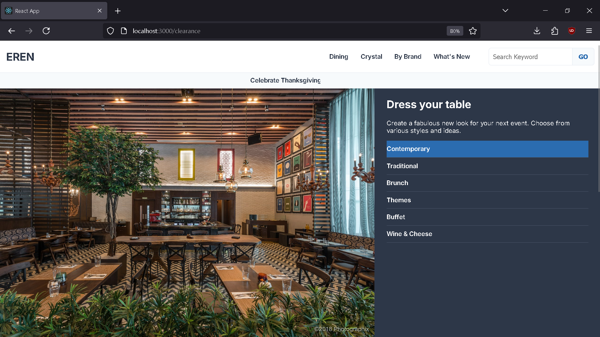

# Responsive E-Commerce Homepage

A modern, fully responsive e-commerce style homepage built with React. This project showcases a mobile-first design approach, component-based architecture, and interactive UI elements handled with React state.

**Live Demo Link:** [**Your Live Site URL Will Go Here**](https://e-commercewebsite-khaki.vercel.app/) ---


## About The Project

This project is a hands-on exercise in building a modern webpage from the ground up using React. The goal was to take a classic e-commerce layout and rebuild it with modern, responsive techniques. The site is designed to be fully functional and visually appealing on all devices, from small mobile phones to large desktop screens.

---

### Key Features

* **Mobile-First Responsive Design:** Styled for mobile first, then scales up to desktop using CSS Flexbox and Media Queries.
* **Component-Based Architecture:** The UI is broken down into logical, reusable React components (`Header`, `Hero`, `Featured`, etc.).
* **Interactive UI with State:**
    * A collapsible "hamburger" menu for mobile navigation, managed with React's `useState` hook.
    * An interactive image gallery in the Hero section where clicking a category updates the displayed image.
* **CSS Animations:**
    * A seamless, infinitely scrolling promotional text banner created with CSS Keyframe animations.
    * Smooth transitions and hover effects on cards and buttons for an enhanced user experience.

---

### Technologies Used

* **React.js:** For building the user interface with components and managing state.
* **HTML (JSX):** For structuring the content within React components.
* **CSS3:** For all styling, including:
    * **Flexbox:** For creating all major layouts (both row and column based).
    * **Media Queries:** For handling the responsive design adjustments.
    * **Keyframe Animations:** For the scrolling promo bar.
    * **Transitions:** For smooth hover and active state effects.
* **Git & GitHub:** For version control.
* **GitHub Pages:** For deployment.

---

### How to Run This Project Locally

1.  Clone the repository:
    ```bash
    git clone [https://github.com/YOUR_USERNAME/YOUR_REPOSITORY_NAME.git](https://github.com/YOUR_USERNAME/YOUR_REPOSITORY_NAME.git)
    ```
2.  Navigate into the project directory:
    ```bash
    cd YOUR_REPOSITORY_NAME
    ```
3.  Install the dependencies:
    ```bash
    npm install
    ```
4.  Start the development server:
    ```bash
    npm start
    ```
5.  Open [http://localhost:3000](http://localhost:3000) to view it in the browser.